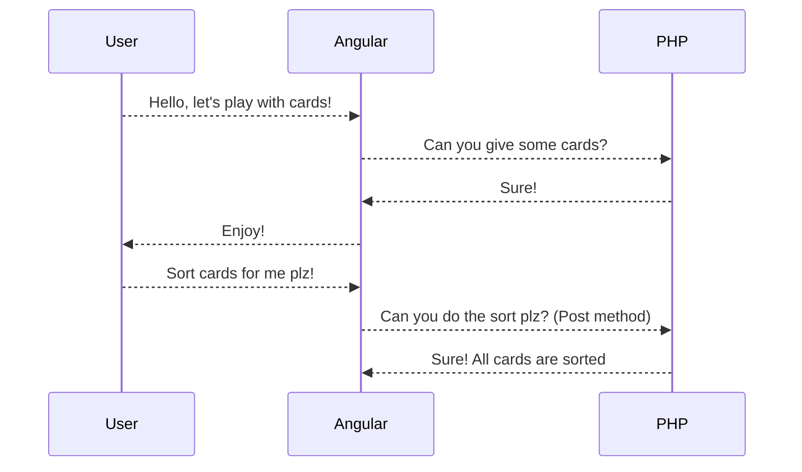
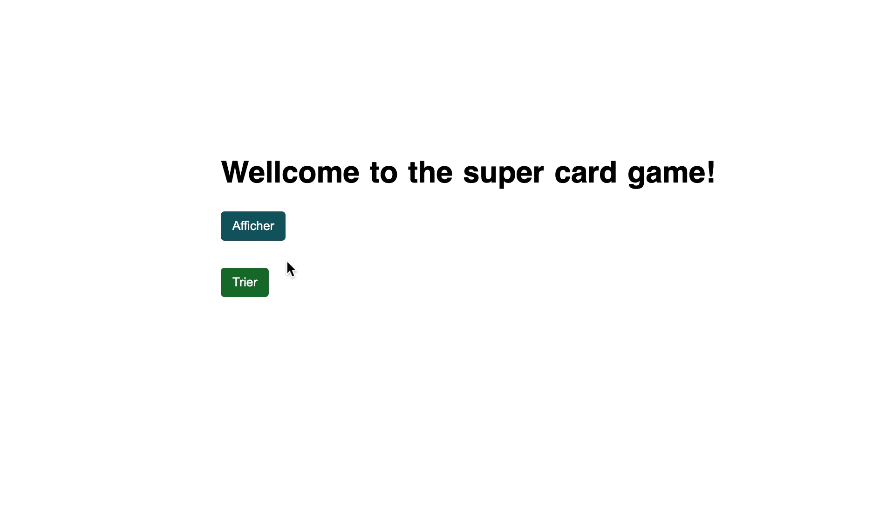

# Atexo cards game
This project was developed as part of a technical test for the company [Atexos](https://www.atexo.com/). For the sake of simplicity and to ensure agnostic approach, we opted for a Dockerized solution.

## Solution
We suggest the following solution:

### Diagram


### Screenshot



## How to step up

All you need is **Docker** and **Docker Compose** to run the project locally.

### Build
Run the following command and simply wait a moment for the container creation to complete. Keep an eye on your terminal until you see the confirmation.
>atexo-test-front-1  | ✔ Compiled successfully.

```bash
 docker-compose up --build
```

### Let's play!

Open this link [http://localhost:4200/card](http://localhost:4200/card) in your favorite browser to interact with the cards.

To test the backend API in standalone mode, simply visit the following links:

-   [http://localhost:8000/api/hand](http://localhost:8000/api/hand) (using the GET method)
-   [http://localhost:8000/api/sort](http://localhost:8000/api/sort) (using the POST method)

For the second link, you can use Postman or simply curl.

    curl --location 'http://0.0.0.0:8000/api/sort' \ --header 'Content-Type: application/json' \ --data '[ { "color": "Pique", "value": "Dame" }, { "color": "Trefle", "value": "As" }, { "color": "Coeur", "value": "Roi" }, { "color": "Pique", "value": "5" }, { "color": "Carreaux", "value": "8" }, { "color": "Trefle", "value": "Roi" }, { "color": "Coeur", "value": "5" }, { "color": "Coeur", "value": "8" }, { "color": "Carreaux", "value": "9" }, { "color": "Coeur", "value": "6" } ]'

### Run tests (Unit & Integration)
```sh
  # Connect to the PHP container
  docker-compose exec php /bin/sh
  
  # Navigate to the backend directory
  cd back
  
  # Run all tests
  php vendor/bin/phpunit
```
